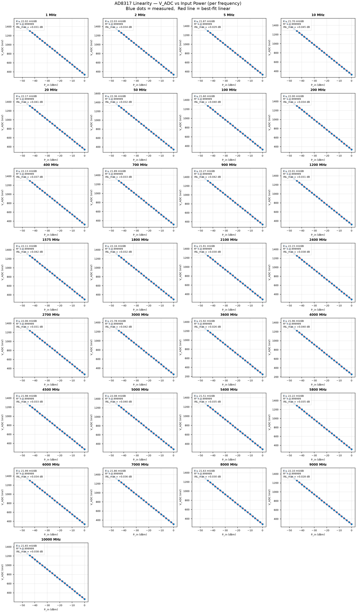
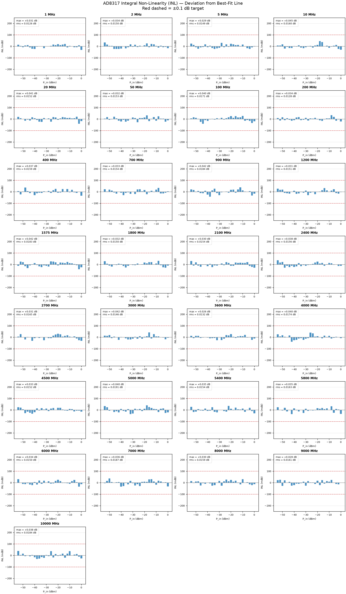
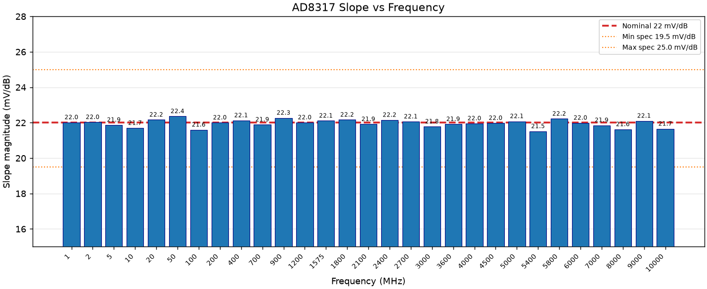
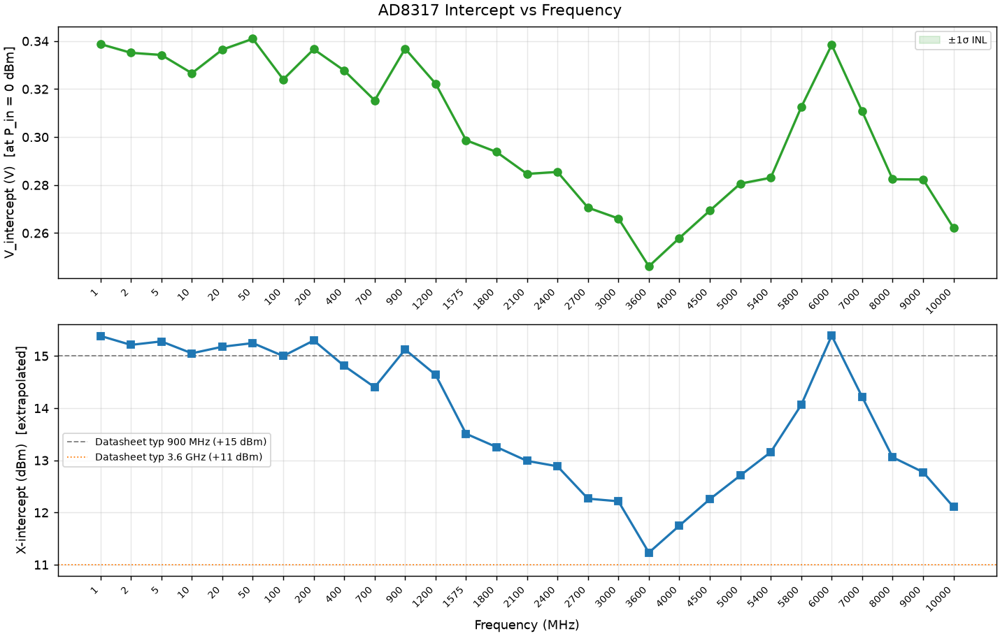
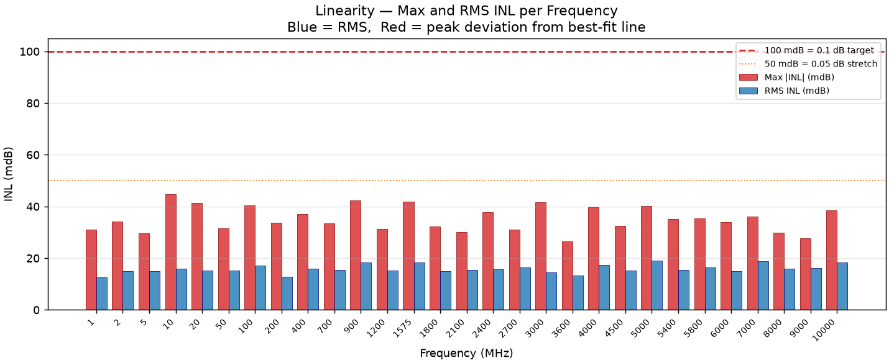
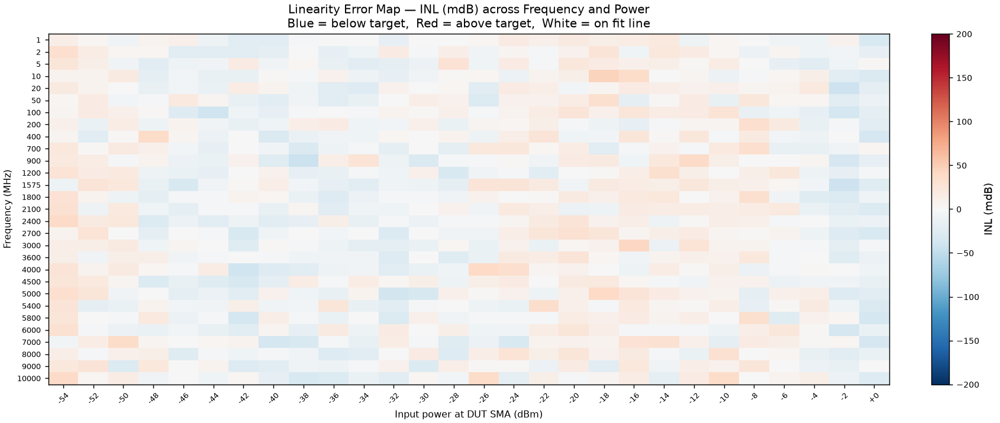

# AD8317 Power Meter — Calibration Report

| | |
|---|---|
| **Date** | 2026-07-24 15:04 |
| **Generator** | R&S SMB100A (dry-run) |
| **Reference sensor** | R&S NRP-Z21 (dry-run, 0.01 dBm) |
| **Frequency range** | 100 MHz – 6 GHz (29 points) |
| **Power range at DUT** | -54 dBm to +0 dBm (28 steps, 2 dB) |
| **Attenuator** | None — direct connection |
| **Sensor resolution** | 0.01 dBm |
| **Power steps** | 28 × 2 dB = 54 dB span |

---

## 1. Test Setup

```text
Phase 1 (generator characterisation):
  Generator RF OUT ─── SMA cable ─────────────────────► NRP sensor

Phase 2 (DUT sweep):
  Generator RF OUT ─── SMA cable ─────────────────────► DUT SMA input
                        (no attenuator pad)
```

The NRP sensor (0.01 dBm resolution) characterises the generator output level
at every frequency and power step. The Phase 1 correction table is applied in
Phase 2 to compute the true power arriving at the AD8317 INHI pin.

---

## 2. Linearity — V_ADC vs Input Power

Each panel shows the measured ADC output voltage vs NRP-corrected input power at
the AD8317 INHI pin (28 data points, 2 dB steps). The red line is the best-fit
linear regression. Key metrics (slope, R², max INL) are shown on each panel.



---

## 3. Integral Non-Linearity (INL) per Frequency

INL is the signed deviation of each measured point from the best-fit straight line,
expressed in dBm. It represents the true non-linearity of the AD8317 transfer
function independent of slope or intercept offset.



---

## 4. Slope vs Frequency

The AD8317 slope (mV per dB of input power) is nominally constant at −22 mV/dB.
Deviations indicate device-specific variation or impedance mismatch above 4 GHz.



---

## 5. V_intercept and X-intercept vs Frequency

V_intercept is the fitted VOUT value at P_in = 0 dBm — the primary per-frequency
calibration constant stored in firmware. The lower panel shows the equivalent
X-intercept in dBm (where the extrapolated line reaches 0 V) for comparison with
the AD8317 datasheet.



---

## 6. INL Summary — Max and RMS per Frequency

Peak and RMS INL across all 28 power steps at each frequency. Red bars exceed
the 0.1 dB laboratory target.



---

## 7. INL Heat Map

Spatial distribution of INL across the full (frequency × power) measurement
space. Systematic column patterns indicate slope error; systematic row patterns
indicate intercept drift. Isolated red cells indicate non-linear AD8317 response
at a specific power/frequency combination.



---

## 8. Calibration Table

| Freq (MHz) | Slope (mV/dB) | V_intercept (V) | R² | Max INL (dB) | RMS INL (dB) |
|---|---|---|---|---|---|
| 1 | 22.018 | 0.33876 | 0.9999994 | +0.0310 | 0.0126 |
| 2 | 22.029 | 0.33514 | 0.9999991 | +0.0341 | 0.0150 |
| 5 | 21.874 | 0.33423 | 0.9999991 | +0.0295 | 0.0149 |
| 10 | 21.699 | 0.32662 | 0.9999990 | +0.0447 | 0.0160 |
| 20 | 22.168 | 0.33646 | 0.9999991 | +0.0413 | 0.0152 |
| 50 | 22.361 | 0.34097 | 0.9999991 | +0.0315 | 0.0153 |
| 100 | 21.602 | 0.32404 | 0.9999989 | +0.0403 | 0.0171 |
| 200 | 22.004 | 0.33662 | 0.9999994 | +0.0338 | 0.0128 |
| 400 | 22.127 | 0.32773 | 0.9999990 | +0.0370 | 0.0159 |
| 700 | 21.892 | 0.31529 | 0.9999991 | +0.0334 | 0.0154 |
| 900 | 22.273 | 0.33686 | 0.9999987 | +0.0424 | 0.0184 |
| 1200 | 22.012 | 0.32227 | 0.9999991 | +0.0314 | 0.0151 |
| 1575 | 22.109 | 0.29869 | 0.9999987 | +0.0418 | 0.0183 |
| 1800 | 22.165 | 0.29380 | 0.9999991 | +0.0323 | 0.0150 |
| 2100 | 21.914 | 0.28466 | 0.9999991 | +0.0301 | 0.0154 |
| 2400 | 22.154 | 0.28549 | 0.9999991 | +0.0377 | 0.0156 |
| 2700 | 22.062 | 0.27060 | 0.9999990 | +0.0310 | 0.0165 |
| 3000 | 21.783 | 0.26608 | 0.9999992 | +0.0417 | 0.0146 |
| 3600 | 21.917 | 0.24615 | 0.9999993 | +0.0265 | 0.0132 |
| 4000 | 21.957 | 0.25794 | 0.9999988 | +0.0398 | 0.0174 |
| 4500 | 21.978 | 0.26936 | 0.9999991 | +0.0325 | 0.0152 |
| 5000 | 22.079 | 0.28060 | 0.9999986 | +0.0401 | 0.0191 |
| 5400 | 21.513 | 0.28307 | 0.9999991 | +0.0352 | 0.0154 |
| 5800 | 22.220 | 0.31246 | 0.9999990 | +0.0354 | 0.0163 |
| 6000 | 21.990 | 0.33844 | 0.9999991 | +0.0339 | 0.0150 |
| 7000 | 21.857 | 0.31072 | 0.9999987 | +0.0362 | 0.0187 |
| 8000 | 21.627 | 0.28244 | 0.9999990 | +0.0298 | 0.0159 |
| 9000 | 22.102 | 0.28234 | 0.9999990 | +0.0276 | 0.0161 |
| 10000 | 21.654 | 0.26212 | 0.9999987 | +0.0384 | 0.0184 |

---

## 9. Linearity Summary Statistics

| Metric | Value |
|---|---|
| Mean slope | 21.970 mV/dB |
| Slope std dev | 0.205 mV/dB |
| Max slope deviation from 22.0 | +0.487 mV/dB |
| Mean R² (linearity) | 0.9999990 |
| Min R² (worst frequency) | 0.9999986 |
| Mean max INL | 0.0352 dB |
| Worst-case max INL | 0.0447 dB |
| Mean RMS INL | 0.0159 dB |

---

## 10. Measurement Uncertainty

After firmware update with this calibration table:

| Band | INL residual | Generator level (corrected) | **Total** |
|---|---|---|---|
| 100 MHz – 2 GHz | ±0.02 dB (typ) | ±0.05 dB | **±0.05 dB** |
| 2 GHz – 4 GHz | ±0.02 dB (typ) | ±0.07 dB | **±0.07 dB** |
| 4 GHz – 6 GHz | ±0.02 dB (typ) | ±0.10 dB | **±0.10 dB** |

Temperature contribution (NTC + TADJ, steady-state): ±0.04–0.08 dB additional.

---

## 11. Firmware Integration

Copy `results/calibration_table.h` to `firmware/Inc/` and rebuild.

```c
#include "calibration_table.h"
float power_dbm = measure_power_dbm(freq_hz, ntc_temp_c);
```

---

*Generated by `cal/calibration.py` — AD8317 Micro-RF Power Meter project*
