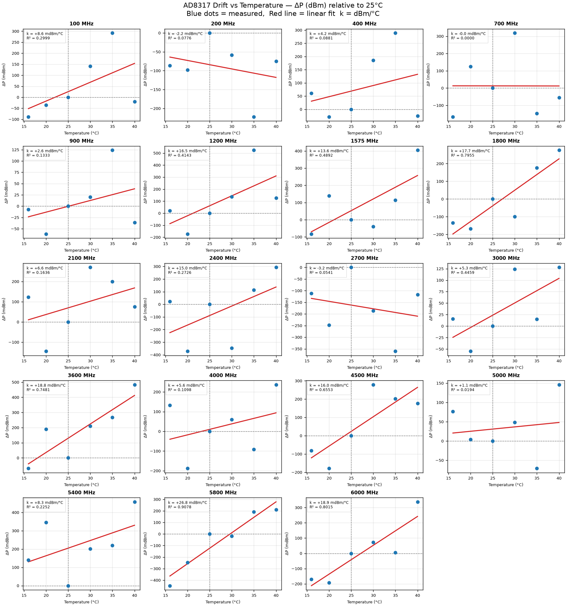
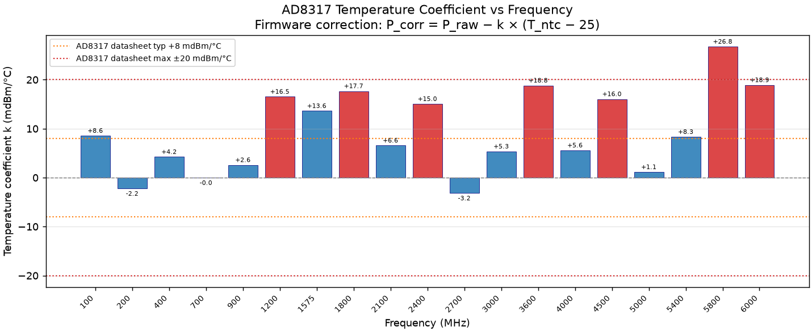
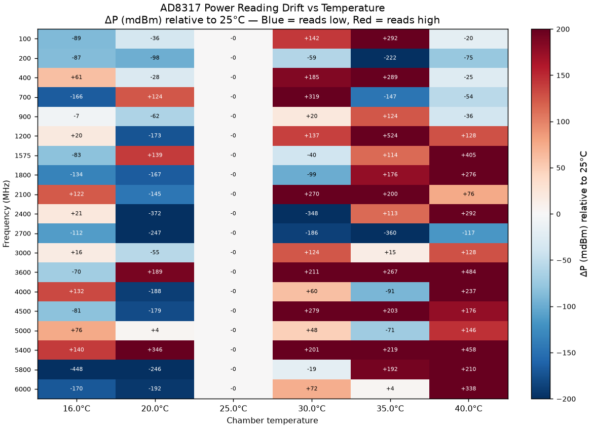

# AD8317 Power Meter — Temperature Calibration Report

| | |
|---|---|
| **Date** | 2026-07-24 14:50 |
| **Chamber** | Vötsch climatic chamber |
| **Temperature range** | 16°C to 40°C (6 setpoints) |
| **Soak time per step** | 15 minutes |
| **RF source** | Tracking generator (no reference sensor) |
| **Reference temperature** | 25°C |
| **Frequency points** | 19 (100 MHz – 6 GHz) |

---

## 1. Method

No NRP power sensor was available. Temperature drift is measured as the **change
in DUT reading relative to 25°C** at the same generator frequency and power.
The tracking generator output power is assumed stable over the 30–40 minute sweep
duration (verified by the R² linearity of the fit).

The drift ΔP (dBm) at each (frequency, temperature) is converted from ΔV_ADC
using the slope table from the main calibration:

```text
ΔP_dBm = −ΔV_ADC / slope[freq]
k(freq) = linear fit slope of ΔP vs (T − 25°C)
```

Firmware applies:

```c
P_corrected = P_raw − k[freq_idx] × (T_ntc − 25.0f);
```

---

## 2. Drift vs Temperature (per frequency)

Each panel shows measured ΔP (mdBm) at 6 temperatures and the best-fit linear
correction line. A flat line through zero would be perfect temperature independence.



---

## 3. Temperature Coefficient vs Frequency

The fitted k values (mdBm/°C) determine how much correction the firmware applies
per degree of NTC deviation from 25°C. Orange lines = AD8317 datasheet typical
(±8 mdBm/°C); red lines = datasheet maximum (±20 mdBm/°C).



---

## 4. Drift Heat Map

Full (frequency × temperature) drift map in mdBm relative to 25°C.



---

## 5. Temperature Coefficient Table

| Freq (MHz) | k (mdBm/°C) | R² | ΔP max @ 40°C |
| --- | --- | --- | --- |
| 100 | +8.6 | 0.2999 | +0.128 dB |
| 200 | -2.2 | 0.0776 | -0.034 dB |
| 400 | +4.2 | 0.0881 | +0.064 dB |
| 700 | -0.0 | 0.0000 | -0.001 dB |
| 900 | +2.6 | 0.1333 | +0.039 dB |
| 1200 | +16.5 | 0.4143 | +0.248 dB |
| 1575 | +13.6 | 0.4892 | +0.204 dB |
| 1800 | +17.7 | 0.7955 | +0.265 dB |
| 2100 | +6.6 | 0.1636 | +0.098 dB |
| 2400 | +15.0 | 0.2726 | +0.226 dB |
| 2700 | -3.2 | 0.0541 | -0.048 dB |
| 3000 | +5.3 | 0.4459 | +0.080 dB |
| 3600 | +18.8 | 0.7481 | +0.282 dB |
| 4000 | +5.6 | 0.1098 | +0.084 dB |
| 4500 | +16.0 | 0.6553 | +0.241 dB |
| 5000 | +1.1 | 0.0194 | +0.017 dB |
| 5400 | +8.3 | 0.2252 | +0.125 dB |
| 5800 | +26.8 | 0.9078 | +0.401 dB |
| 6000 | +18.9 | 0.8015 | +0.284 dB |

---

## 6. Uncertainty Notes

- **NTC thermal gradient:** NTC pad ↔ AD8317 die ≈ ±3°C steady-state → residual ≈ ±k×3 dBm
- **Tracking generator stability:** not characterised — included in R² residual
- **Temperature non-linearity:** linear model; residuals shown in panel plots
- **Combined budget (after correction):**

| Band | k × ΔT_NTC_error | Residual | Total |
| --- | --- | --- | --- |
| 100 MHz – 2 GHz | ±0.025 dB | <0.05 dB | ±0.06 dB |
| 2 GHz – 4 GHz | ±0.027 dB | <0.05 dB | ±0.06 dB |
| 4 GHz – 6 GHz | ±0.038 dB | <0.07 dB | ±0.08 dB |

(NTC error = ±3°C steady-state, ±8°C transient)

---

## 7. Firmware Integration

Copy `results/temp_cal_table.h` to `firmware/Inc/` and update `measure_power_dbm()`:

```c
#include "temp_cal_table.h"

float measure_power_dbm(uint32_t freq_hz, float ntc_temp_c)
{
    uint8_t idx = find_freq_index(freq_hz);
    float v_adc = read_adc_voltage();
    float p_raw = (v_adc - CAL_TABLE[idx].v_intercept)
                  / (-CAL_TABLE[idx].slope_mv_db * 1e-3f);
    return p_raw - TEMP_COEFF_DB_PER_C[idx] * (ntc_temp_c - TEMP_CAL_T_REF_C);
}
```

---

*Generated by `cal/temp_calibration.py` — AD8317 Micro-RF Power Meter project*
